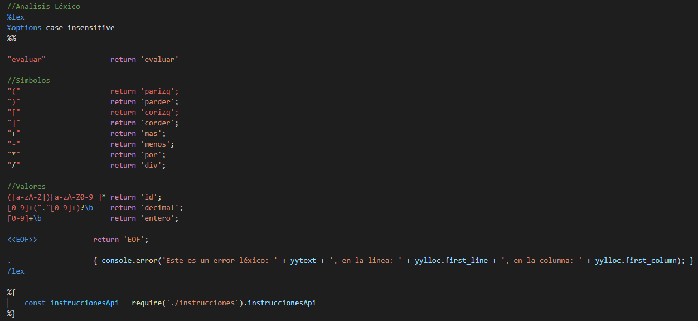
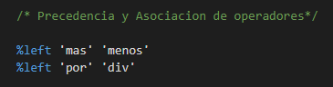
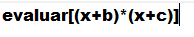

# Expresiones Aritméticas A Código En 3 Direcciones

El siguiente interprete recibe como entrada una exprexión aritmética y devuelve su respectivo código en 3 direcciones.

Especificación del análisis léxico

Asignación de asociatividad y precedencia de operadores

Traducción dirigida por la sintaxis

Ejecución: 

1) Crear un archivo de entrada que se llame "entrada.txt"

    

2) Correr el comando -> node parser

3) Salida

    
